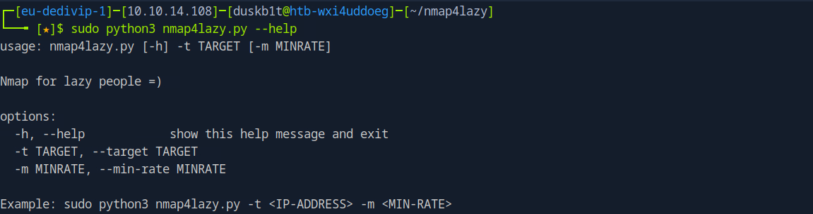

# nmap4lazy

**nmap4lazy** is a Python script that automates an Nmap discovery scan over all TCP ports. Essentially, it conducts a SYN scan across all TCP ports, extracts the ones opened, and performs another version scan to ensure uncommon open ports aren't missed, as can happen with default settings.

# Usage

First, clone the repository and display the help menu.

```bash
git clone https://github.com/duskb1t/nmap4lazy
cd nmap4lazy

python3 nmap4lazy.py --help
```



All that is left is to run the scan as root.

```bash
python3 nmap4lazy.py -t 10.129.228.120 -m 500
```


